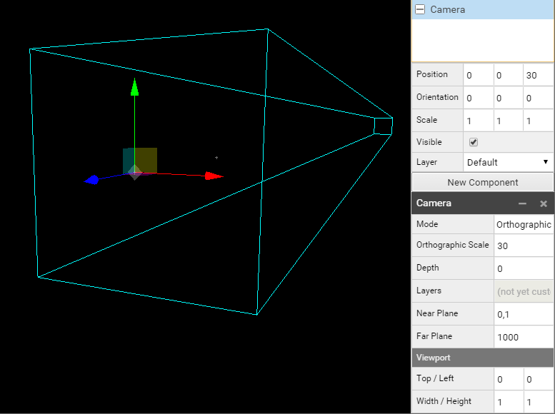
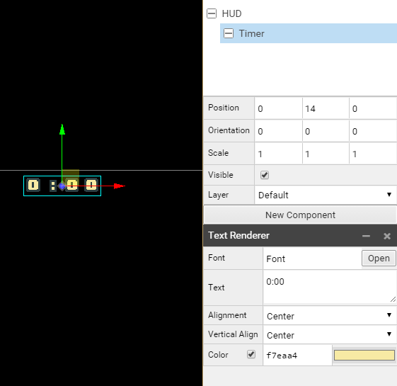
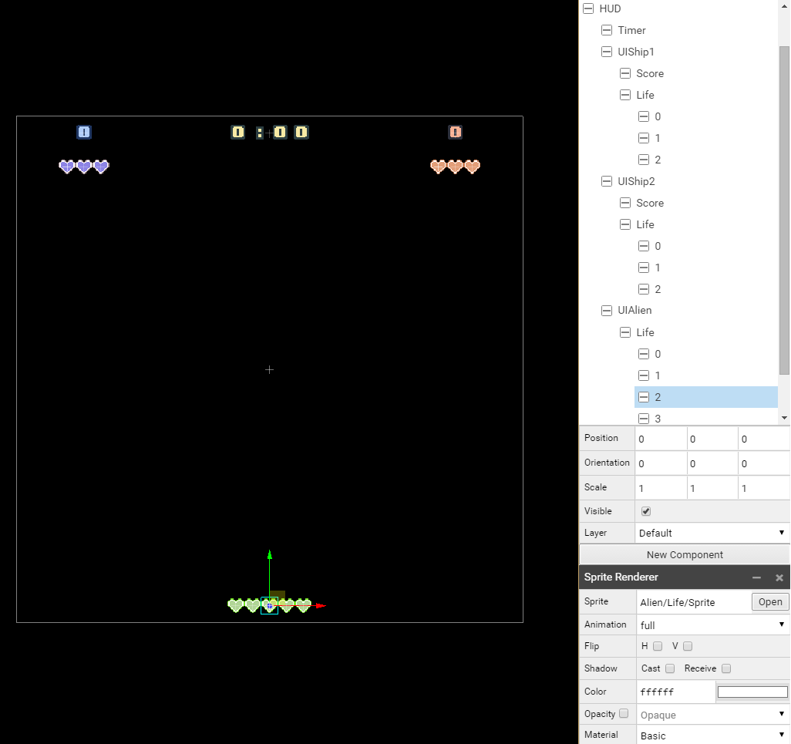
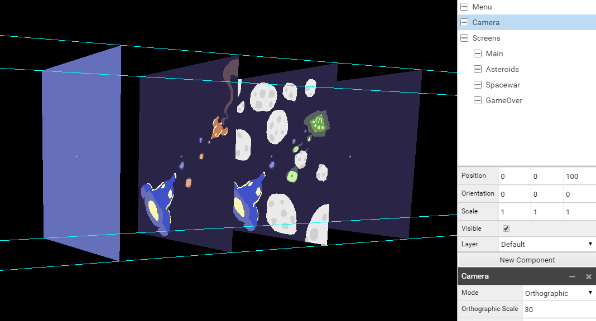
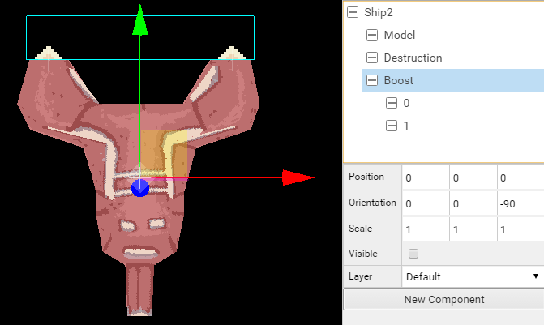
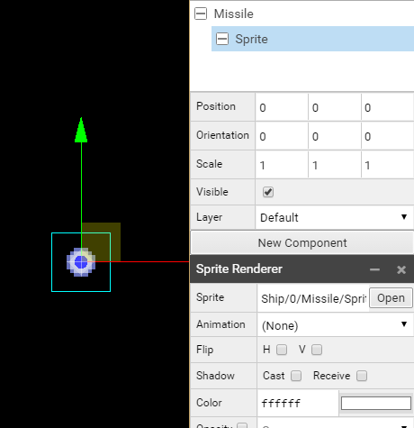
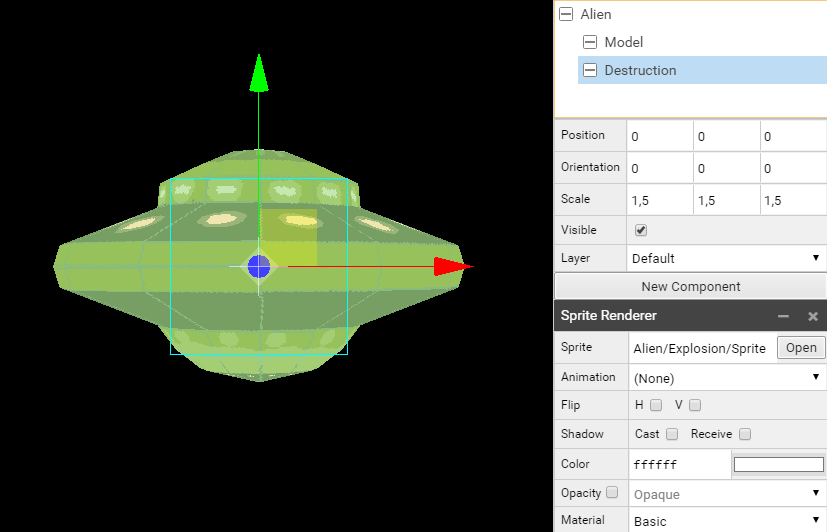
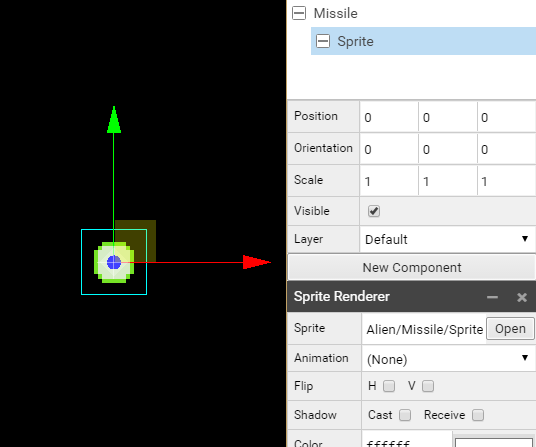
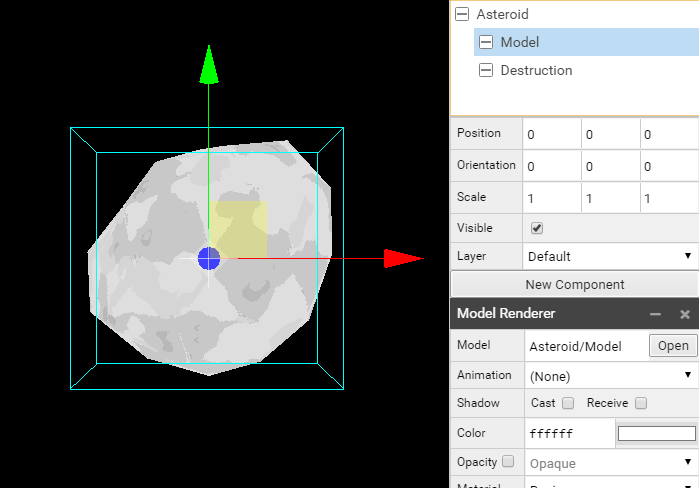

# SUPERPOWERS TUTORIAL #4
## SUPER ASTEROIDS and SUPER SPACEWAR, Chapter 4

### **Setting the game scene and prefabs**

All our assets are loaded and ready, an important step before to start to code our game is 
to compose basics scene of our game, the scene are a kind of canva where we can draw the 
game shape with Superpowers tools. The scene will give us the foundation on which we will write
the code of our game to make all actors interact together.

#### **Game Scene**

We start with the main game scene in *Game/Scene*, we have an empty canva where we can create the actors we will need for the game.

An actor is an object we can interact with, it can be attach to different component, a camera, a behavior, a model, a sprite, a text.  
Here also there is no universal rule of what should be an actor and what compose it, but as a personal choice, I will use one actor with one component only.

##### Behavior

We create a first actor **Game**, we create in it a new component Behavior and attach to it, the **GameBehavior** Class.

The Game actor won't have a visual effect but simply attach the Game behavior to the Game scene, the behavior will load when the scene itself load.

##### Camera

To have a game screen we need a camera, we create a new actor **Camera** with a new component Camera.

We check the position default is x = 0, y = 0 and we set the z position to 30, we give a lot of space for all the actors to be placed inside the camera area on Z axis, between 0 and 30 units.
We set the camera Mode to Orthographic and the Scale to 30 (remember 30 units of 16 pixels = 480).

We now have our camera set, we will place the background and the HUD (the user interface).

##### HUD

We create a new Actor HUD that won't have any component but be the parent of many other actors, we can change its position to change the position of all childs.
We set the position to z at 25 in a way to have all the elements of the HUD to come on tope over all others actors of the game (ships, asteroids, alien).

We first add a **Timer** actor child of the HUD to position (0, 14, 0), which will be the main game timer. We attach a new component Text Renderer. 
We attach our Font to it and set the color to yellow. (code : f7eaa4)

We now create a **UIShip1** actor, child of HUD to position (-12, 12, 0), a **UIShip2** actor, child of HUD to position (10, 12, 0) and an **UIAlien** actor, child of HUD to position (0, -14, 0).

We set off the visibility of UIShip2 actor because we want a default configuration for the Asteroids game, when we will choose the Spacewar game, visibilities will change.

We create two Score Actor childs of actors UIShip1 and UIShip2 to Position (1, 2, 0), and we attach to both of them a Text Renderer with the Font Font, 
a default Text 0 and colors for HUD/UIShip1/Score of afccf8 and for HUD/UIShip2/Score of f8b194.

To place on the screen the life hearts, we going to place them individually, one heart for one actor with each a new component sprite renderer with the heart sprite related to ship1, ship2 or alien. 
It is an easy way to access from the code later to each heart and change the status of the one we are interested to. We give the same name of an heart with it's position index.
the first heart on the left will have the index 0, the next will have 1, and so on. It will be really useful later to access them using a loop.

Alien have 5 hearts, here all the parameters of the HUD to configure the hearts in the right positions :

* HUD, Position (0, 0, 25), Visible true, 
   * Timer, Position (0, 14, 0), Visible true, Text Renderer, Font Font, Text 0:00, Color f7eaa4
   * UIShip1, Position (-12, 12, 0), Visible true, 
      * Score, Position (1, 2, 0), Text Renderer, Font Font, Text 0, Color afccf8
      * Life, Position (0, 0, 0)
         * 0, Position (**0**, 0, 0), Sprite Renderer, Sprite Ship/0/Life/Sprite, Animation full
         * 1, Position (**1**, 0, 0), Sprite Renderer, Sprite Ship/0/Life/Sprite, Animation full
         * 2, Position (**2**, 0, 0), Sprite Renderer, Sprite Ship/0/Life/Sprite, Animation full
   * UIShip2, Position (10, 12, 0), Visible **false**, 
      * Score, Position (1, 2, 0), Text Renderer, Font Font, Text 0, Color f8b194
      * Life, Position (0, 0, 0)
         * 0, Position (**0**, 0, 0), Sprite Renderer, Sprite Ship/1/Life/Sprite, Animation full
         * 1, Position (**1**, 0, 0), Sprite Renderer, Sprite Ship/1/Life/Sprite, Animation full
         * 2, Position (**2**, 0, 0), Sprite Renderer, Sprite Ship/1/Life/Sprite, Animation full
   * UIAlien, Position (0, -14, 0), Visible true, 
      * Life, Position (0, 0, 0)
         * 0, Position (**-2**, 0, 0), Sprite Renderer, Sprite Alien/Life/Sprite, Animation full
         * 1, Position (**-1**, 0, 0), Sprite Renderer, Sprite Alien/Life/Sprite, Animation full
         * 2, Position (**0**, 0, 0), Sprite Renderer, Sprite Alien/Life/Sprite, Animation full
         * 3, Position (**1**, 0, 0), Sprite Renderer, Sprite Alien/Life/Sprite, Animation full
         * 4, Position (**2**, 0, 0), Sprite Renderer, Sprite Alien/Life/Sprite, Animation full
         
We have now a complete HUD :

##### Background

Now we create a new actor Background far behind other actors Position (0, 0, **-30**) to wich we attach a new component Behavior with the class BackgroundBehavior.

We create a child actor to Background actor name Sprite to the position (0, **-15**, 0) and we attach a new component Sprite Renderer with the *Background/Sprite*. (The top of the background sprite
should be the same than the top of the camera.

Here the final result we want to achieve :

We can set the Game Scene as the startup scene and start the game to see if everything work fine.

#### **Menu Scene**

##### Behavior

In Menu/Scene we first create a Menu actor to which we attach a component Behavior with the MenuBehavior Class.

##### Camera

We then create an actor Camera with a component Camera, the camera has Orthographic Mode with a scale of 30. We set the camera to a z position of 100. (We give space for all the screens)

##### Screens

We create an actor Screens that will be parents of Main, Asteroids, Spacewar and the GameOver Screens. Each screen actor have a sprite renderer component with the correct path for each.

Here the differents parameters :

* Screens
   * Main, Position (0, 0, 0), Sprite Renderer, Sprite *Menu/Screens/Main/Sprite*
   * Asteroids, Position (0, 0, 20), Sprite Renderer, Sprite *Menu/Screens/Asteroids/Sprite*
   * Spacewar, Position (0, 0, 40), Sprite Renderer, Sprite *Menu/Screens/Spacewar/Sprite*
   * GameOver, Position (0, 0, 60), Sprite Renderer, Sprite *Menu/Screens/GameOver/Sprite*

##### Buttons

We create an actor Buttons with two child actors Button1 and Button2 which both have a sprite and a text actor.

Here the parameters for all actors :

* Buttons, Position (0, 0, 80)
   * Button1, Position (6, -7, 0)
      * Sprite, Sprite Renderer, Sprite *Menu/Button/Sprite*
      * Text, Text Renderer, Font Font, Text START
   * Button2, Position (6, -12, 0)
      * Sprite, Sprite Renderer, Sprite *Menu/Button/Sprite*
      * Text, Text Renderer, Font Font, Text RETURN

##### Title

Here the parameters for all actors :

We create an actor Title with two actors Text1 and Text2, both with a text Renderer. We change the size of the text here with the Scale of the actor.

* Title, Position (0, 0, 80)
   * Text1, Position (0, 13, 0), Scale (2, 2, 2), Text Renderer, Font Font, Text SUPER
   * Text2, Position (0, 11, 0), Scale (2, 2, 2), Text Renderer, Font Font, No default text
   
Once button and title is set, we should have something like this :

#### Ship Prefab

Prefabs are little scenes with specific actors with their components we add and remove from the Game Scene when we need them. We need prefab for each of our main game actor, the ship1 and the ship 2 (if the game is
spacewar), the alien ship and an asteroid (for the asteroid game).

##### Behavior

To Ship/0/Prefab we add an actor Ship1 and to Ship/1/Prefab we add an actor Ship2 with a component Behavior and the Class ShipBehavior linked to it.

##### Model

We create an actor Model, child of Ship1 actor, with a component Model Renderer and the Ship/0/Model as Model.
We do the same for Ship2 of Ship/1/Prefab, with a component Model Renderer and the Ship/1/Model as Model.

We both change the Orientation to (90, 0, 0) to see the top of the ship in 2D mode.

##### Destruction

We create for both ship an actor Destruction, which contain the component Sprite renderer with the Sprite Explosion related to each ship.

##### Boost

We add to each ship two little sprite that we will use when the ship is moving, we need to place them precisely.
We create a Boost Actor with an orientation of (0, 0, -90) to have them aligned to the Ship Orientation and set Visible to false.
We create two new actors for the Boost actor than we call 0 and 1 and we put the first (0) in Position (2.1, -2.76, 0) and the second in Position (2.1, -2.76, 0), both with a new component
Sprite Renderer with the Sprite Ship/Boost/Sprite.

Here the complete structure of the prefabs :

Ship/0/Prefab
* Ship1, Position(0, 0, 0), Orientation(0, 0, **90**), Behavior, Class ShipBehavior
   * Model, Orientation(0, **90**, **90**), Model Renderer, Model *Ship/0/Model*
   * Destruction, Sprite Renderer, Sprite *Ship/0/Explosion/Sprite*
   * Boost, Orientation (0, 0, **-90**), Visible off
      * 0, Position (2.1, -2.76, 0), Sprite Renderer, Sprite *Ship/Boost/Sprite*
      * 1, Position (-2.1, -2.76, 0), Sprite Renderer, Sprite *Ship/Boost/Sprite*

Ship/1/Prefab
* Ship2, Position(0, 0, 0), Orientation(0, 0, **-90**), Behavior, Class ShipBehavior
   * Model, Orientation(0, **90**, **90**), Model Renderer, Model *Ship/1/Model*
   * Destruction, Sprite Renderer, Sprite *Ship/1/Explosion/Sprite*
   * Boost, Orientation (0, 0, **-90**), Visible off
      * 0, Position (2.1, -2.76, 0), Sprite Renderer, Sprite *Ship/Boost/Sprite*
      * 1, Position (-2.1, -2.76, 0), Sprite Renderer, Sprite *Ship/Boost/Sprite*

#### Ship Missile Prefab

We work now on Ship/0/Missile/Prefab and Ship/1/Missile/Prefab.

##### Behavior

We create an actor Missile with a Behavior component to which we attach the Class ShipMissileBehavior.

##### Sprite

Child of Missile actor, we create an actor Sprite with a component Sprite Renderer and the Sprite Ship/0/Missile/Sprite for Ship1 and Ship/1/Missile/Sprite for Ship2.

Ship/0/Missile/Prefab
* Missile, Position(0, 0, 0)
   * Sprite, Sprite Renderer, Sprite *Ship/0/Missile/Sprite*

Ship/1/Missile/Prefab
* Missile, Position(0, 0, 0)
   * Sprite, Sprite Renderer, Sprite *Ship/1/Missile/Sprite*

#### Alien Prefab

We work now on Alien/Prefab, the settings are really close to what we have done before.

##### Behavior

We create an actor Alien with a Behavior component to which we attach the Class AlienBehavior.

##### Model

We create an actor Model, child of Alien actor, with a component Model Renderer and the Alien/Model as Model.

##### Destruction

We create an actor Destruction, child of Alien actor with a Sprite Renderer component with the Sprite Alien/Explosion/Sprite.

Alien/Prefab
* Alien, Position(0, 0, 0), Behavior, Class AlienBehavior
   * Model, Model Renderer, Model *Alien/Model*
   * Destruction, Scale (1.5, 1.5, 1.5), Sprite Renderer, Sprite *Alien/Explosion/Sprite*
   

   
#### Alien Missile Prefab

We work now on Alien/Missile/Prefab.

See Ship Missile description.

* Missile, Position(0, 0, 0)
   * Sprite, Sprite Renderer, Sprite *Alien/Missile/Sprite*

#### Asteroid Prefab

We work now on Asteroid/Prefab.
Like for the Ship and Alien we create actors with their related component and parameters.

* Asteroid, Position(0, 0, 0), Behavior, Class AsteroidBehavior
   * Model, Model Renderer, Model *Asteroid/Model*
   * Destruction, Sprite Renderer, Sprite *Asteroid/Explosion/Sprite*

[<-- back to chapter 3](ch3.md) -- [go to chapter 5 -->](ch5.md)